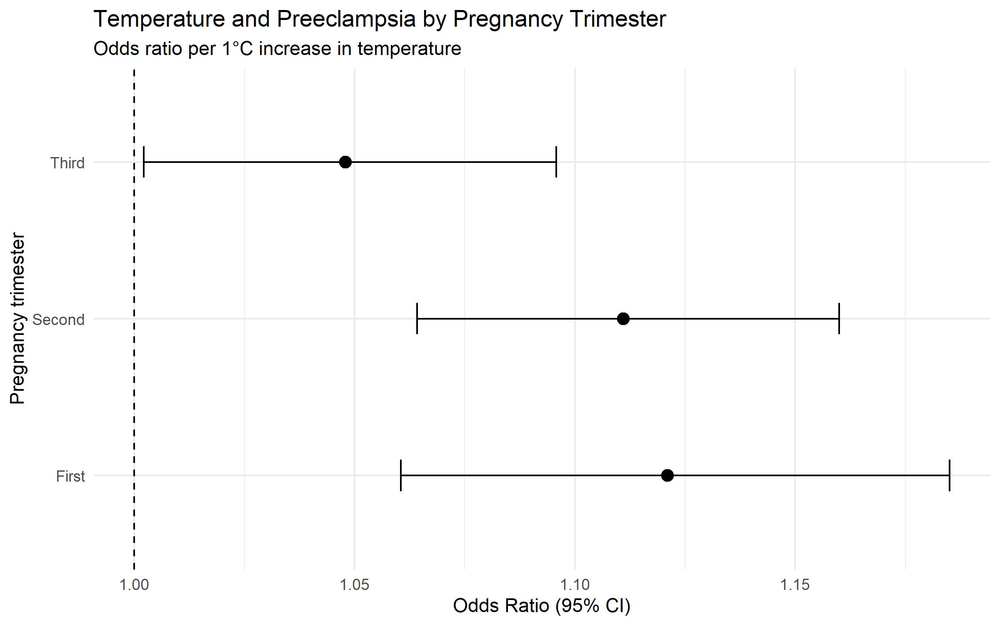
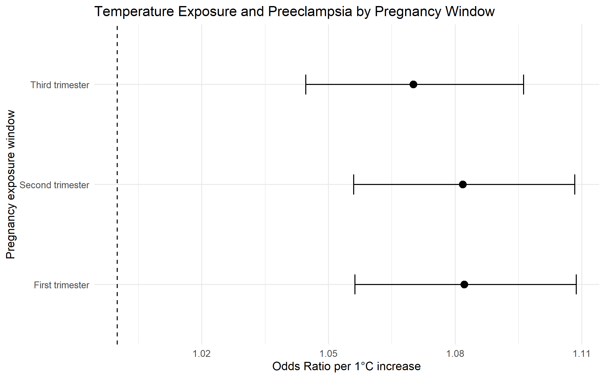

# UAE Heat, Air Pollution and Pregnancy Epidemiology

## A Synthetic Environmental Epidemiology Portfolio

### Research Question

How are extreme heat and ambient air-pollution exposures during pregnancy associated with maternal complications and early-life growth in a synthetic UAE pregnancy cohort, and do these associations vary by pregnancy stage, socioeconomic conditions and access to green space?

---

## Abstract

### Background

Pregnancy may represent an important period of vulnerability to environmental exposures such as extreme heat and ambient air pollution. Understanding exposure during different stages of pregnancy may help identify potentially important windows of susceptibility for maternal and early-life outcomes.

This portfolio presents a synthetic environmental epidemiology study designed to demonstrate an analytical workflow for investigating temperature and air-pollution exposure during pregnancy.

### Methods

A synthetic pregnancy cohort of 10,000 pregnancies was generated using R. Simulated environmental exposure variables included mean pregnancy temperature and ambient PM2.5 concentration. Maternal outcomes included preeclampsia and gestational diabetes, while birthweight was examined as an early-life outcome.

Multivariable logistic regression was used to examine associations between temperature, PM2.5 and maternal outcomes. Linear regression was used for birthweight. Pregnancy-stage analyses examined temperature exposure during the first, second and third trimesters. Additional analyses assessed temperature-by-trimester interaction, socioeconomic and green-space effect modification, cumulative temperature exposure, non-linear exposure-response relationships and sensitivity to alternative temperature exposure definitions.

### Results

Higher temperature was positively associated with preeclampsia in the synthetic cohort after adjustment for PM2.5, maternal age, trimester and region. Higher PM2.5 was also positively associated with preeclampsia.

Temperature showed positive associations with gestational diabetes and an inverse association with birthweight in the synthetic data.

Temperature associations with preeclampsia were observed across all three pregnancy trimesters. However, there was no statistically strong evidence that the temperature association differed by trimester.

There was no strong evidence of temperature effect modification by socioeconomic index or green-space access. A natural spline analysis also did not provide evidence that a non-linear temperature specification improved model fit over the linear model.

Results remained directionally consistent across alternative temperature exposure definitions, including cumulative temperature exposure and high-versus-lower heat exposure.

### Conclusion

This synthetic portfolio demonstrates an environmental epidemiology workflow for studying pregnancy-related exposure to heat and air pollution. The analyses demonstrate multivariable modelling, exposure-window analysis, interaction testing, non-linearity assessment and sensitivity analysis.

Because all cohort, exposure and outcome data are simulated, the findings should not be interpreted as real UAE epidemiological estimates or as evidence of causal relationships.

---

## 1. Background

Environmental exposures during pregnancy are an important area of epidemiological research because pregnancy involves substantial physiological changes and may represent a period of vulnerability to environmental stressors.

Heat exposure and ambient air pollution are particularly relevant environmental exposures in regions experiencing high temperatures and rapid urbanisation.

This project uses a synthetic UAE pregnancy cohort to demonstrate how environmental exposure data could be integrated with pregnancy and health outcome data within an epidemiological research workflow.

The project is designed as a methodological portfolio rather than an analysis of real clinical or population surveillance data.

---

## 2. Research Question

How are extreme heat and ambient air-pollution exposures during pregnancy associated with maternal complications and early-life growth in a synthetic UAE pregnancy cohort, and do these associations vary by pregnancy stage, socioeconomic conditions and access to green space?

---

## 3. Objectives

### Primary objective

To investigate the association between temperature exposure during pregnancy and preeclampsia in a synthetic pregnancy cohort.

### Secondary objectives

1. To examine the association between PM2.5 exposure and preeclampsia.
2. To examine associations between temperature, PM2.5 and gestational diabetes.
3. To assess associations between environmental exposures and birthweight.
4. To examine temperature exposure across different pregnancy trimesters.
5. To assess whether the temperature-preeclampsia association varies by pregnancy trimester.
6. To assess socioeconomic index and green-space access as potential effect modifiers.
7. To evaluate whether a non-linear temperature specification improves model fit.
8. To examine cumulative temperature exposure across pregnancy.
9. To assess the robustness of findings using alternative exposure definitions.

---

## 4. Study Design

This project uses a synthetic observational pregnancy cohort.

The cohort contains 10,000 simulated pregnancies.

The analysis was developed entirely in R using reproducible scripts.

### Important data disclaimer

All pregnancy characteristics, health outcomes and environmental exposure variables used in this portfolio are simulated.

The dataset does not represent a real UAE pregnancy registry, hospital database or environmental monitoring dataset.

The results therefore demonstrate statistical methodology and analytical reasoning rather than real-world epidemiological estimates.

---

## 5. Study Population

The synthetic cohort contains 10,000 pregnancies.

Simulated maternal characteristics include:

- maternal age
- gestational week
- geographic region
- pregnancy trimester

The simulated geographic regions are:

- Dubai
- Abu Dhabi
- Sharjah

---

## 6. Environmental Exposures

The primary environmental exposures were:

- mean pregnancy temperature
- mean PM2.5 concentration
- heat exposure category

Temperature was measured in degrees Celsius.

PM2.5 was represented as a simulated ambient particulate matter exposure.

Heat exposure was categorised into:

- Lower
- High

A high-heat category was defined using a simulated temperature threshold of 35°C.

---

## 7. Pregnancy Exposure Windows

Additional synthetic exposure variables were generated to demonstrate exposure-window analysis.

These included:

- early-pregnancy temperature
- mid-pregnancy temperature
- late-pregnancy temperature
- cumulative temperature exposure

These variables were generated from the overall pregnancy temperature with controlled random variation.

They therefore demonstrate the analytical concept of pregnancy exposure windows but should not be interpreted as genuine longitudinal environmental measurements.

---

## 8. Health Outcomes

The primary maternal outcome was:

**Preeclampsia**

Secondary outcomes included:

**Gestational diabetes**

and:

**Birthweight**

Preeclampsia and gestational diabetes were represented as binary outcomes.

Birthweight was represented in grams.

---

## 9. Statistical Analysis

Multivariable logistic regression was used for binary outcomes.

The primary preeclampsia model included:

- mean temperature
- PM2.5
- maternal age
- trimester
- region

A linear regression model was used to examine birthweight.

Pregnancy-stage analyses examined temperature exposure separately during:

- first trimester
- second trimester
- third trimester

A formal temperature-by-trimester interaction model was also fitted.

Additional analyses examined:

- socioeconomic effect modification
- green-space effect modification
- temperature non-linearity
- cumulative temperature exposure
- alternative heat exposure definitions

---

## 10. Reproducibility

All major analyses were implemented using separate R scripts.

The project structure is:

```text
01_Project_Protocol/
02_Code/
03_Data/
04_Results/
05_Report/

The `02_Code` directory contains the reproducible R analysis scripts, while `04_Results` contains generated statistical results and figures. The `05_Report` directory contains the analytical reports and final research report.

---

## 11. Results

### 11.1 Cohort characteristics

The synthetic cohort contained **10,000 pregnancies**.

The mean maternal age was approximately **31.5 years**, with simulated ages ranging from 18 to 45 years.

The mean pregnancy temperature was approximately **32.0°C**, while mean PM2.5 concentration was approximately **29.9**.

The simulated prevalence of preeclampsia was **6.36%**, while the prevalence of gestational diabetes was **9.60%**.

High heat exposure, defined as a mean temperature of at least 35°C, was present in approximately **16.8%** of pregnancies.

### 11.2 Temperature and preeclampsia

In the fully adjusted logistic regression model, higher mean temperature was positively associated with preeclampsia.

Each **1°C increase in mean temperature** was associated with approximately **9% higher odds of preeclampsia**:

**OR 1.090, 95% CI 1.061–1.120, p < 0.001.**

The model adjusted for:

- mean PM2.5
- maternal age
- trimester
- region

### 11.3 PM2.5 and preeclampsia

Higher simulated PM2.5 exposure was also positively associated with preeclampsia.

Each one-unit increase in PM2.5 was associated with approximately **2% higher odds of preeclampsia**:

**OR 1.020, 95% CI 1.010–1.031, p < 0.001.**

These findings are based entirely on the simulated data-generating structure and should not be interpreted as estimates from a real UAE population.

### 11.4 Temperature and gestational diabetes

Higher temperature was positively associated with gestational diabetes in the synthetic cohort.

Each 1°C increase in mean temperature was associated with approximately **6% higher odds of gestational diabetes**:

**OR 1.059, 95% CI 1.036–1.083, p < 0.001.**

PM2.5 also showed a positive association with gestational diabetes in the adjusted model.

### 11.5 Temperature and birthweight

Higher temperature was inversely associated with birthweight in the synthetic cohort.

Each 1°C increase in mean temperature was associated with an estimated **34.9-gram lower birthweight**:

**β = −34.91 g, 95% CI −37.85 to −31.97, p < 0.001.**

The model explained approximately **7.5% of the variation in birthweight**.

### 11.6 Temperature across pregnancy trimesters

Temperature was positively associated with preeclampsia across all three pregnancy exposure windows.

| Pregnancy window | Odds Ratio | 95% CI | P value |
|---|---:|---:|---:|
| First trimester | 1.082 | 1.056–1.109 | <0.001 |
| Second trimester | 1.082 | 1.056–1.108 | <0.001 |
| Third trimester | 1.070 | 1.045–1.096 | <0.001 |

The estimated associations were similar during the first and second trimesters and somewhat weaker during the third trimester.

However, these results do **not** establish a critical window of susceptibility.

### 11.7 Temperature × trimester interaction

A formal temperature-by-trimester interaction analysis was performed to determine whether the temperature-preeclampsia association differed statistically across pregnancy stages.

The interaction terms did not provide statistically strong evidence that the temperature association differed between trimesters.

The interaction p-values were:

- Temperature × second trimester: **p = 0.803**
- Temperature × third trimester: **p = 0.064**

The estimated temperature odds ratios were:

| Pregnancy trimester | OR per 1°C increase | 95% CI |
|---|---:|---:|
| First | 1.121 | 1.060–1.185 |
| Second | 1.111 | 1.064–1.160 |
| Third | 1.048 | 1.002–1.096 |

Although the estimated association was strongest in the first trimester and weakest in the third trimester, the analysis did not provide strong statistical evidence of heterogeneity by trimester.
### Figure 1. Temperature and preeclampsia across pregnancy trimesters

The figure below presents the estimated odds ratios and 95% confidence intervals for the association between a 1°C increase in temperature and preeclampsia across the three pregnancy trimesters.



### 11.8 Socioeconomic and green-space effect modification

Potential effect modification by socioeconomic conditions and green-space access was assessed using interaction models.

There was no strong evidence that socioeconomic index modified the temperature-preeclampsia association:

**Likelihood-ratio test p = 0.186.**

There was also no strong evidence that green-space access modified the association:

**Likelihood-ratio test p = 0.235.**

These analyses demonstrate the statistical workflow for assessing effect modification. Because the socioeconomic and green-space variables were synthetically generated, these findings should not be interpreted as evidence about real-world inequalities or environmental protection.

### 11.9 Non-linear temperature exposure-response relationship

A natural spline model with three degrees of freedom was compared with the primary linear temperature model.

The spline model did not significantly improve model fit:

**Likelihood-ratio test p = 0.829.**

The linear specification was therefore retained for the primary synthetic analysis.

This result should be interpreted as a property of the simulated dataset rather than evidence that the real-world temperature-preeclampsia relationship is necessarily linear.

### 11.10 Cumulative temperature exposure

A synthetic cumulative temperature exposure measure was created by averaging simulated early-, mid- and late-pregnancy temperature exposure.

In the adjusted model, cumulative temperature exposure was positively associated with preeclampsia:

**OR 1.096, 95% CI 1.068–1.125, p < 0.001.**

This corresponds to approximately **9.6% higher odds of preeclampsia per 1°C increase in cumulative temperature exposure**.

This analysis demonstrates an exposure-window approach but is **not a true distributed lag non-linear model**, because the project does not contain genuine daily environmental measurements linked to individual gestational dates.
### Figure 2. Temperature and preeclampsia across pregnancy exposure windows

The figure below presents the estimated temperature-preeclampsia associations across pregnancy exposure windows.



### 11.11 Sensitivity analysis

The direction of association was consistent across alternative temperature exposure definitions.

| Exposure definition | Odds Ratio | 95% CI |
|---|---:|---:|
| Overall mean temperature | 1.090 | 1.061–1.120 |
| Cumulative temperature exposure | 1.096 | 1.068–1.125 |
| High versus lower heat | 1.606 | 1.323–1.939 |

The sensitivity analysis therefore demonstrated consistency in the direction of the simulated association across different exposure definitions.

Because the exposure and outcome data were simulated, this consistency should not be interpreted as evidence of robustness in a real population.

### 11.12 Summary of key findings

Overall, the synthetic analyses demonstrated:

1. A positive association between temperature and preeclampsia.
2. A positive association between PM2.5 and preeclampsia.
3. A positive association between temperature and gestational diabetes.
4. An inverse association between temperature and birthweight.
5. Positive temperature-preeclampsia associations across all three pregnancy trimesters.
6. No strong statistical evidence of temperature effect modification by trimester.
7. No strong evidence of effect modification by socioeconomic index or green-space access.
8. No evidence that a natural spline model improved fit over the linear temperature model.
9. A positive association between cumulative temperature exposure and preeclampsia.
10. Consistent direction of association across alternative exposure definitions.

These findings are **simulated methodological results** and do not represent real UAE epidemiological estimates.

---

## 12. Interpretation

The analyses demonstrate how an environmental epidemiology study could investigate multiple dimensions of pregnancy-related environmental exposure.

The primary synthetic analysis showed a positive association between temperature and preeclampsia after adjustment for PM2.5, maternal age, trimester and region.

The trimester-specific analyses suggested positive associations throughout pregnancy, but the formal interaction analysis did not provide strong evidence that the association differed statistically between pregnancy stages.

The cumulative exposure and sensitivity analyses showed similar directions of association across alternative exposure definitions.

The absence of strong evidence for socioeconomic or green-space effect modification should not be interpreted as evidence that these factors are unimportant in real populations. In this project, these variables were synthetically generated and were not derived from observed environmental or socioeconomic datasets.

Similarly, the absence of evidence for non-linearity reflects the simulated data structure and does not establish that temperature-health relationships are linear in real-world populations.

---

## 13. Strengths

Key strengths of the portfolio include:

- a clearly defined environmental epidemiology research question
- reproducible analysis using R
- explicit separation of data generation, analysis and reporting
- multivariable regression modelling
- pregnancy-stage exposure analysis
- formal interaction testing
- effect modification analysis
- non-linearity assessment
- cumulative exposure analysis
- sensitivity analysis
- transparent documentation of synthetic data limitations
- reproducible project organisation suitable for GitHub

---

## 14. Limitations

The most important limitation is that the dataset is entirely synthetic.

The simulated environmental exposures do not represent actual measurements from UAE monitoring stations.

The pregnancy outcomes do not represent actual clinical records.

The trimester-specific temperature variables are simulated exposure windows rather than genuine time-varying environmental measurements linked to pregnancy dates.

The cumulative exposure analysis therefore demonstrates an exposure-window methodology but is not a true distributed lag non-linear model.

A real environmental epidemiology study would require longitudinal environmental measurements linked to individual pregnancy timelines and clinically validated outcomes.

Additional real-world analyses could incorporate:

- daily temperature measurements
- daily PM2.5 concentrations
- geocoded residential exposure
- pregnancy start and delivery dates
- socioeconomic indicators
- green-space measurements
- clinical registry outcomes
- potential confounders and co-exposures

---

## 15. Ethical Considerations

No identifiable individual-level health information was used in this project.

The dataset was created synthetically for methodological demonstration.

Consequently, the portfolio does not involve analysis of identifiable patient records.

A real-world study using clinical or registry data would require appropriate ethical approval, governance, data-protection safeguards and secure data handling.

---

## 16. Reproducibility and Data Transparency

All major analytical steps were implemented using reproducible R scripts.

The repository separates:

- project protocol
- analysis code
- synthetic data
- analytical results
- research reports

The project does not claim access to confidential clinical data or real UAE pregnancy records.

The synthetic-data approach allows the analytical workflow to be demonstrated transparently without exposing personal or clinical information.

---

## 17. Conclusion

This project demonstrates a reproducible environmental epidemiology workflow investigating temperature and air-pollution exposure during pregnancy.

The portfolio integrates descriptive epidemiology, multivariable regression, pregnancy exposure windows, interaction analysis, effect modification, non-linearity assessment, cumulative exposure analysis and sensitivity analysis.

The project demonstrates how R can be used to structure and reproduce an epidemiological workflow from synthetic cohort generation through statistical modelling and reporting.

Importantly, the findings are simulated methodological results rather than real UAE epidemiological estimates.

The portfolio is intended to demonstrate research thinking, statistical programming, epidemiological reasoning and transparent scientific communication relevant to environmental and reproductive health research.